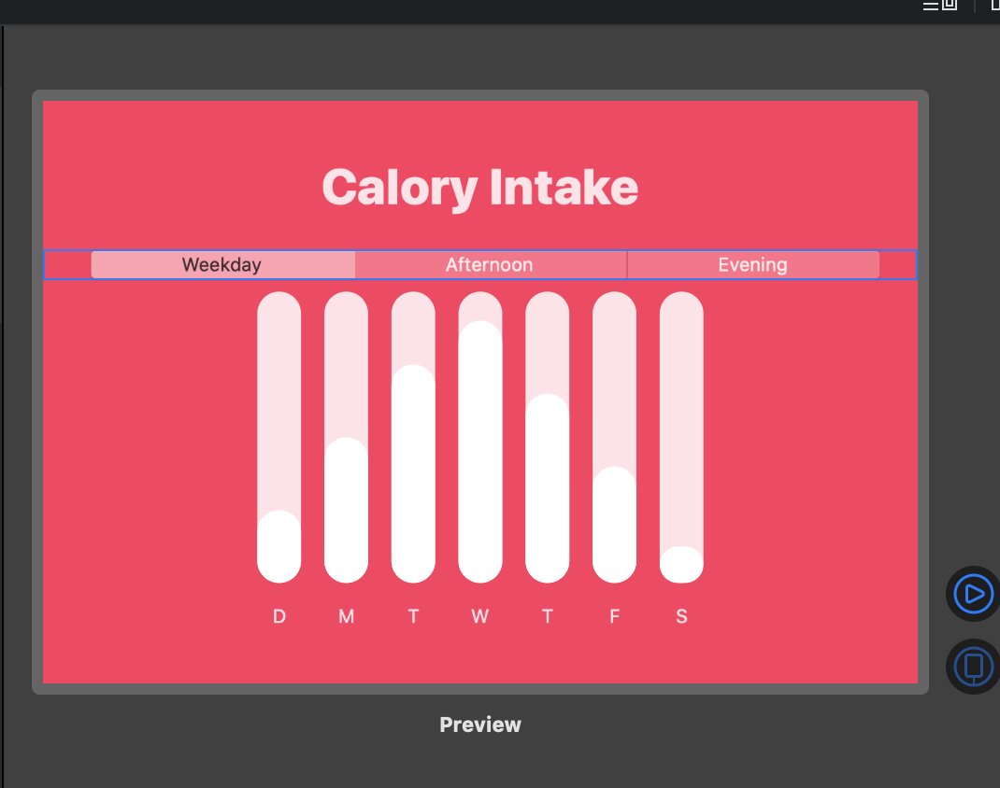
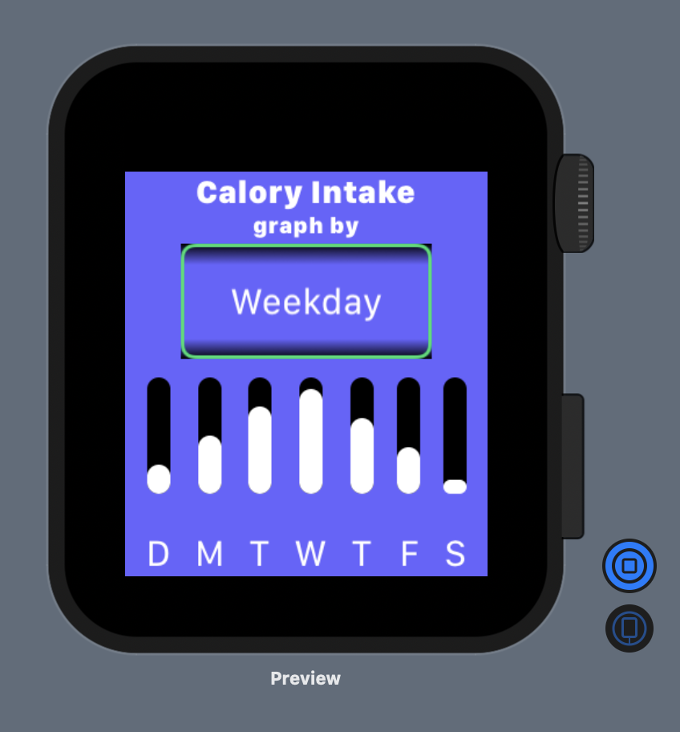
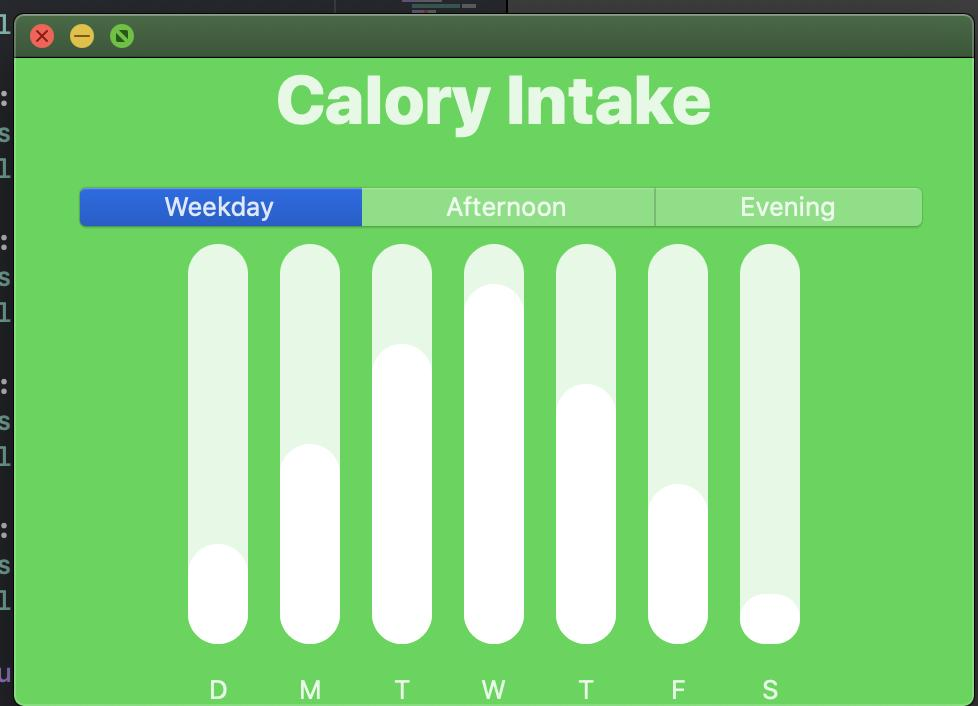
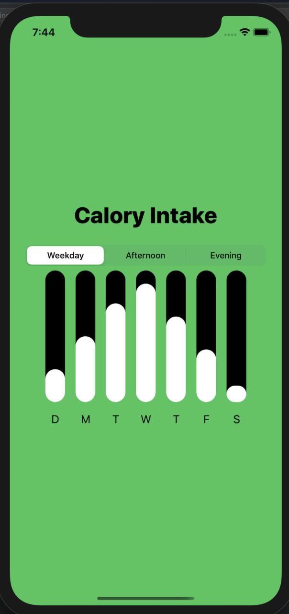

# SwiftUICharts
Some practice with swift UI cross platform capabilities

## Almost the same View code for these:

[comment]: <> (This is a comment, it will not be included)
## Actually Identical View Code

